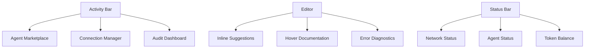
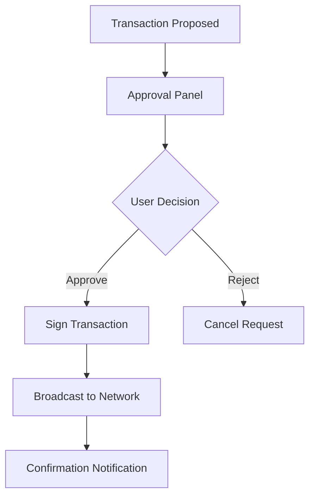
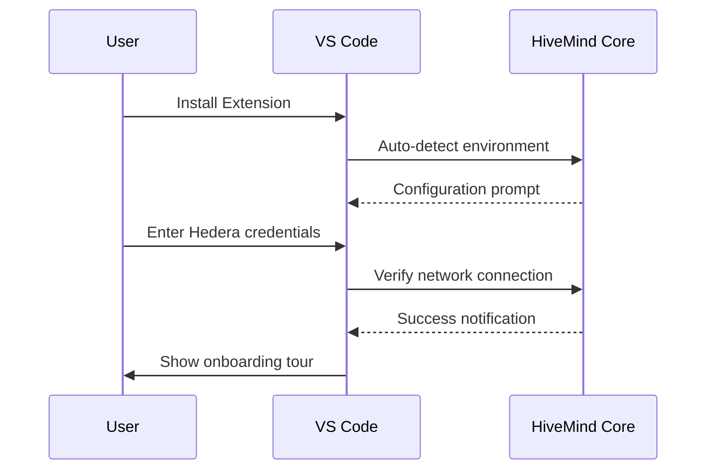
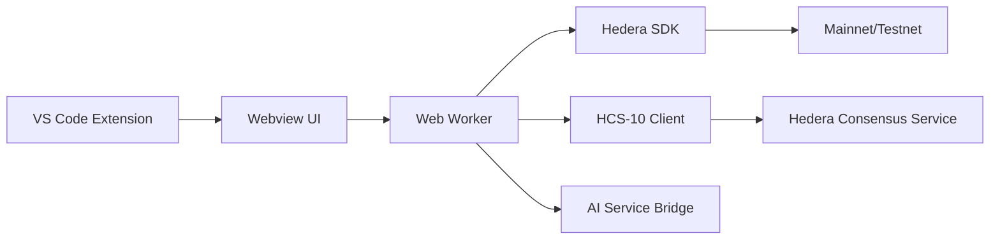

# VS Code Extension PRD: HiveMind Copilot Frontend

## 🌟 Executive Summary
The HiveMind Copilot VS Code Extension provides a seamless interface for decentralized AI collaboration on Hedera. Integrating Python and Solidity workflows, it enables real-time agent interaction, smart contract auditing, and blockchain-native development tools - all within the developer's IDE.

---

## 🎯 Core Objectives
1. **Unified Development Experience**
   - Integrated Python/Solidity workflows
   - Real-time AI agent collaboration
   - Blockchain-native debugging tools

2. **Visual Agent Ecosystem**
   - Agent discovery and management UI
   - Secure communication channels
   - Transaction approval workflows

3. **Performance-Optimized Interface**
   - <100ms UI response time
   - Zero-configuration setup
   - Context-aware assistance

---

## 🖥️ UI/UX Architecture


### Component Structure
| Component | Purpose | Technologies |
|-----------|---------|--------------|
| **Agent Marketplace** | Discover/register agents | React + VSCode Webview |
| **Collaboration Panel** | Agent communication | Monaco Editor + HCS-10 |
| **Audit Dashboard** | Security insights | D3.js + Slither integration |
| **Transaction Center** | Approval workflows | Hedera SDK JS + Schedule TX |

---

## ✨ Core Features

### 1. Agent Collaboration Hub
**Visual Interface:**
```typescript
// packages/frontend/src/components/AgentHub.tsx
import { HCS10Connector } from '@hedera-agent-kit/hcs10';

const AgentHub = () => {
  const [agents, setAgents] = useState<Agent[]>([]);
  
  useEffect(() => {
    const fetchAgents = async () => {
      const registry = new HCS10Connector('0.0.registry');
      const auditors = await registry.queryAgents('security_audit');
      setAgents(auditors);
    };
    fetchAgents();
  }, []);

  return (
    <div className="agent-grid">
      {agents.map(agent => (
        <AgentCard 
          key={agent.accountId}
          name={agent.name}
          capabilities={agent.capabilities}
          responseTime={agent.avgResponse}
          onSelect={() => initiateConnection(agent.accountId)}
        />
      ))}
    </div>
  );
};
```

**Features:**
- Real-time agent discovery
- Performance metrics (response time, success rate)
- One-click connection establishment
- Capability-based filtering

### 2. Smart Contract Workbench
**Solidity Integration:**
```typescript
// packages/frontend/src/features/SolidityAssistant.ts
vscode.languages.registerCodeLensProvider('solidity', {
  provideCodeLenses(document) {
    return [
      new vscode.CodeLens(new vscode.Range(0, 0, 0, 0), {
        title: '📊 Run Security Audit',
        command: 'hivemind.auditContract',
        arguments: [document.uri]
      }),
      new vscode.CodeLens(new vscode.Range(0, 0, 0, 0), {
        title: '🧪 Generate Tests',
        command: 'hivemind.generateTests',
        arguments: [document.uri]
      })
    ];
  }
});
```

**Features:**
- In-file audit triggers
- Vulnerability visualization
- Gas optimization suggestions
- Test generation presets

### 3. Transaction Approval Center
**Workflow UI:**


**Components:**
- Visual transaction summary
- Risk assessment indicators
- Multi-signature support
- History tracking

### 4. Python Development Assistant
**Inline Support:**
```python
# Example of inline code suggestions
from hedera import ContractExecuteTransaction

def call_contract():
    transaction = (
        ContractExecuteTransaction()
        .setContractId("0.0.1234")
        .setGas(500_000)
        # HiveMind Suggestion: 
        # Consider adding .setMaxTransactionFee(2) for testnet stability
        .execute(client)
    )
    return transaction.getReceipt(client)
```

**Features:**
- SDK-specific autocomplete
- Mirror node query integration
- Error resolution tooltips
- Testnet simulation triggers

---

## 🎨 UI Specifications

### Agent Card Component
| Element | Properties | Behavior |
|---------|------------|----------|
| Avatar | Agent type icon | Hover: Show capabilities |
| Name | Agent name (truncated) | Click: Open profile |
| Status | Response time indicator | Color-coded (green/yellow/red) |
| Connect Button | Primary action | Initiate HCS-10 connection |

### Audit Dashboard
| Section | Content | Visuals |
|---------|---------|---------|
| Vulnerability Summary | Critical/High/Medium/Low | Radial progress chart |
| Gas Analysis | Cost by function | Bar chart comparison |
| Code Hotspots | Vulnerability locations | File tree with heatmap |
| Recommendations | Fix suggestions | Expandable cards |

---

## ⚙️ Configuration Workflow

### First-Time Setup


### Settings Interface
```json
{
  "hivemind.enablePythonAssistant": true,
  "hivemind.solidityAuditOnSave": false,
  "hivemind.defaultNetwork": "testnet",
  "hivemind.agentResponseTimeout": 5000,
  "hivemind.groqApiKey": "user_key",
  "hivemind.favoriteAgents": ["security_auditor", "test_gen"]
}
```

---

## 🧪 Testing Strategy

### UI Test Matrix
| Test Type | Tools | Coverage |
|-----------|-------|----------|
| Unit Testing | Jest + React Testing Library | Component logic |
| Integration | Cypress | Feature workflows |
| Performance | Lighthouse | UI responsiveness |
| Accessibility | Axe | WCAG 2.1 compliance |
| Visual Regression | Percy | UI consistency |

### QA Metrics
1. **Responsiveness**
   - <100ms for UI updates
   - <500ms for agent discovery
2. **Reliability**
   - 99.9% successful HCS-10 connections
   - Zero unhandled exceptions
3. **Usability**
   - 90% task success rate (user testing)
   - <2 minute average onboarding time

---

## 📊 Performance Optimization

### Client-Side Architecture


### Optimization Techniques
1. **Lazy Loading**
   - Agents loaded on demand
   - Documentation cached locally
2. **Web Workers**
   - Heavy crypto operations off main thread
   - Parallel agent communication
3. **Selective Rendering**
   - Virtualized agent lists
   - Delta-based UI updates
4. **Network Optimization**
   - HCS message batching
   - Mirror node query caching

---

## 🔒 Security Implementation

### Frontend Security Layers
1. **Credential Management**
   - VS Code Secret Storage API
   - Encrypted at rest
2. **Message Validation**
   ```typescript
   const verifyAgentMessage = (message) => {
     const publicKey = getAgentPublicKey(message.sender);
     const isValid = verifySignature(
       message.payload, 
       message.signature, 
       publicKey
     );
     return isValid && message.timestamp > Date.now() - 30_000;
   };
   ```
3. **Sandboxed Execution**
   - Webview content isolation
   - Restricted node access

---

## 📅 Development Roadmap

### Phase 1: Core Functionality (Weeks 1-4)
| Milestone | Deliverable |
|-----------|-------------|
| Python Assistant | SDK autocomplete, error diagnostics |
| Agent Hub | Marketplace UI, connection management |
| Settings | Configuration interface |

### Phase 2: Solidity Support (Weeks 5-8)
| Milestone | Deliverable |
|-----------|-------------|
| Audit Dashboard | Vulnerability visualization |
| Test Generation | In-IDE test creation |
| Deployment Workflow | Testnet deployment pipeline |

### Phase 3: Enterprise Features (Weeks 9-12)
| Milestone | Deliverable |
|-----------|-------------|
| Transaction Center | Approval workflows |
| Team Collaboration | Shared agent sessions |
| Compliance Tools | Audit trail generation |

---

## 🌐 Integration Points

### Backend Services
| Service | Protocol | Function |
|---------|----------|----------|
| AI Core | gRPC | Code generation, analysis |
| HCS-10 Network | Hedera Consensus Service | Agent communication |
| Mirror Node | REST API | Transaction insights |
| IPFS | HTTP | Decentralized storage |

### VS Code APIs
1. **Language Server Protocol**
   - Python/Solidity diagnostics
   - Code completion
2. **Tree View API**
   - Agent marketplace
   - Audit results
3. **Webview API**
   - Interactive dashboards
4. **Status Bar API**
   - Network indicators
5. **Secret Storage**
   - Secure credential management

---

## ✅ Success Metrics
1. **Developer Productivity**
   - 40% reduction in debugging time
   - 60% faster contract deployment
2. **Agent Adoption**
   - 5+ agents per developer session
   - 90% connection success rate
3. **Quality Improvement**
   - 30% fewer production issues
   - 50% increase in test coverage

> "HiveMind's VS Code extension reduced our contract audit time from hours to minutes while catching critical vulnerabilities missed by traditional tools." - Early Beta Tester

---

## 💡 Future Vision
1. **Agent Marketplace**
   - Token-based payment system
   - Reputation-based ranking
2. **Collaborative Environments**
   - Shared agent sessions
   - Multi-developer debugging
3. **Cross-Chain Support**
   - EVM-compatible chains
   - Multi-ledger transactions
4. **AI Training Suite**
   - Custom agent creation
   - Domain-specific fine-tuning

---

## ✅ Conclusion
The HiveMind Copilot VS Code Extension redefines blockchain development by integrating decentralized AI agents directly into the developer workflow. Through its seamless blend of Python and Solidity support, visual agent collaboration tools, and enterprise-grade security, it delivers:

1. **Unprecedented Efficiency**  
   AI-powered coding assistance
   
2. **Enhanced Security**  
   Real-time contract auditing

3. **Decentralized Collaboration**  
   Trustless agent ecosystem

4. **Streamlined Operations**  
   Integrated transaction management

Designed for performance and extensibility, this extension establishes a new standard for blockchain development environments while providing immediate productivity gains for Hedera developers working with Python and Solidity.